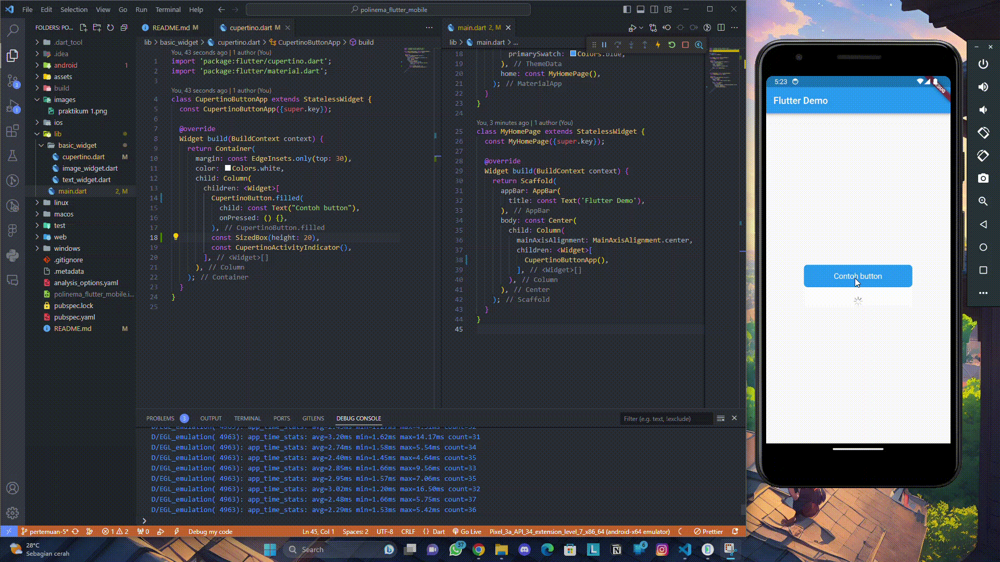
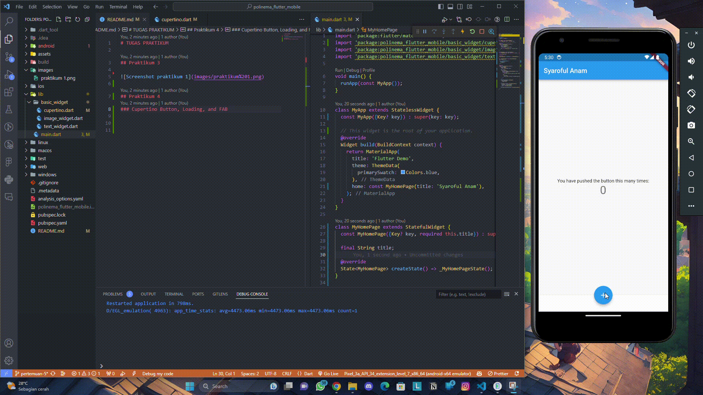
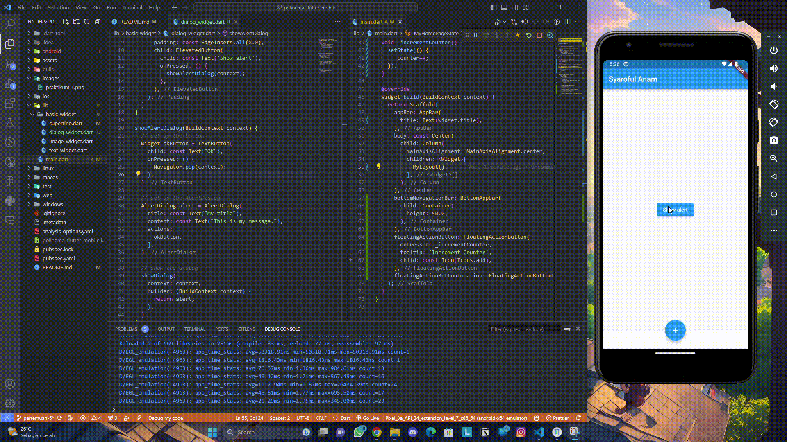
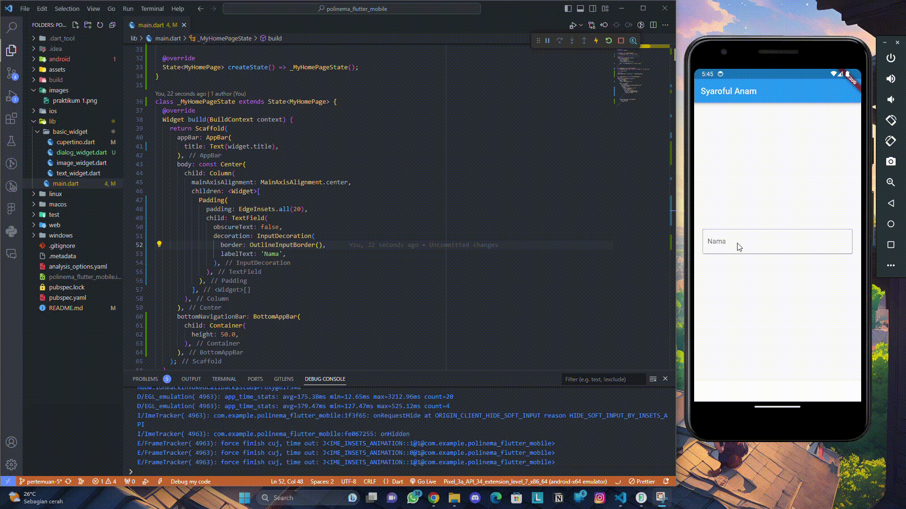
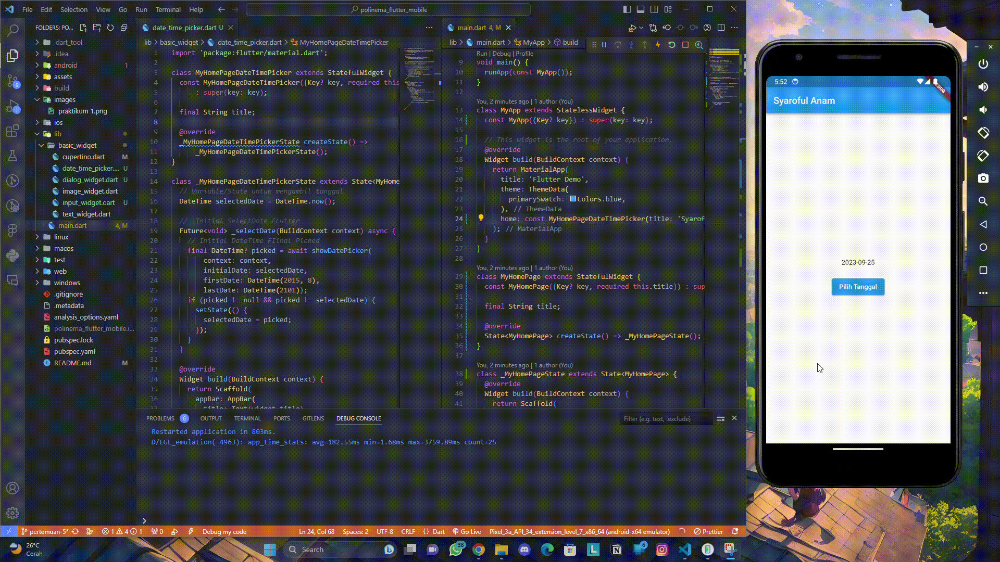

# TUGAS PRAKTIKUM

## Praktikum 1
membuat contoh widget GestureDetector

## Praktikum 4
### Cupertino Button, Loading, and FAB

### Scaffold Widget

### Dialog Widget

### Input Widget

### Date Time Picker

