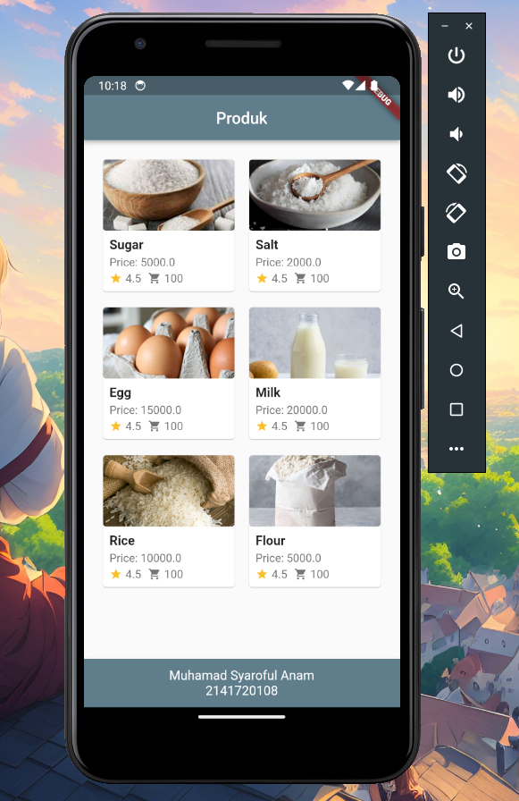
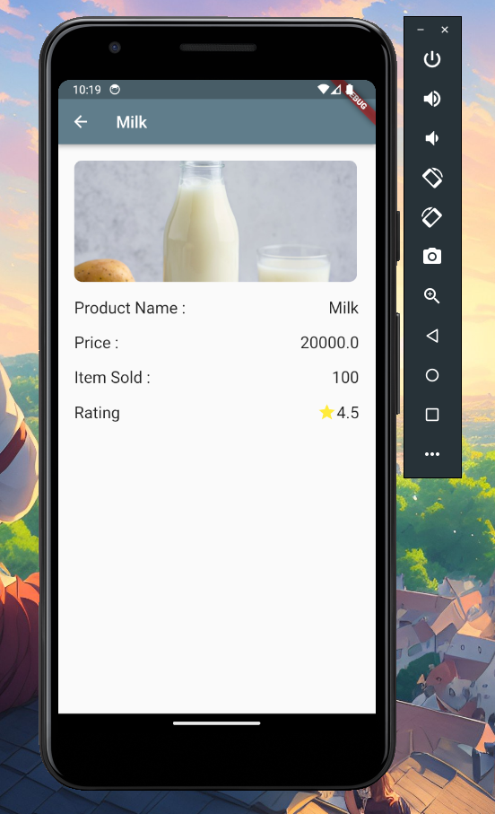

# Laporan UTS Mobile Programming

oleh :
| | |
| --- | --- |
| Nama| Muhamad Syaroful Anam |
| Kelas | TI - 3G |
| NIM | 2141720108

Ini adalah kode untuk membuat laporan pengerjaan UTS pemrograman mobile.
UTS ini berfokus pada penggunaan navigasi pada Flutter.

### Video :


### Gambar :




### Penjelasan :

```
child: GridView.builder(...)
```

Ini adalah widget yang digunakan untuk membuat tampilan GridView yang dinamis. GridView adalah tampilan berbasis grid (kisi) yang dapat digunakan untuk menampilkan elemen-elemen dalam susunan yang teratur, seperti daftar item dalam grid.

```
child: InkWell(
                onTap: () {
                  Navigator.push(
                    context,
                    MaterialPageRoute(
                      builder: (context) {
                        return ItemPage(item: items[index]);
                      },
                    ),
                  );
                },...)
```

`child: InkWell()`: Ini adalah awal dari konstruksi InkWell, yang merupakan widget yang digunakan untuk memberikan respons ketika pengguna menyentuh (tap) pada tampilan yang diberikan. child adalah parameter yang digunakan untuk menentukan widget yang akan menerima interaksi tap.

`MaterialPageRoute`: Ini adalah tipe rute yang digunakan untuk melakukan navigasi dengan efek transisi material (seperti slide). Di dalam `MaterialPageRoute`, terdapat parameter builder, yang digunakan untuk membuat halaman baru yang akan ditampilkan.

```
child: Hero(
    tag: items[index].name,
    child: Container(
        decoration: BoxDecoration(
            borderRadius: BorderRadius.circular(4),
            image: DecorationImage(
                image: AssetImage(items[index].picturePath),
                fit: BoxFit.cover,
                ),
            ),
        ),
    ),
```

`child: Hero`: Ini adalah awal dari konstruksi Hero, yang mengindikasikan bahwa kita akan menggunakan animasi `Hero. child` adalah parameter yang digunakan untuk menentukan elemen yang akan dianimasikan.

`tag: items[index].name`: Ini adalah properti tag yang digunakan untuk mengidentifikasi elemen yang akan dianimasikan. Nilai tag harus sama di halaman asal dan tujuan untuk mencocokkan elemen yang akan dianimasikan.
