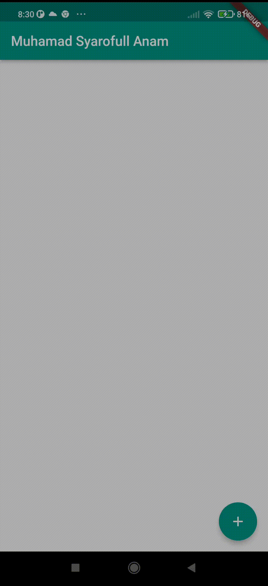

# Laporan Praktikum Mobile Programming

oleh :
| | |
| --- | --- |
| Nama| Muhamad Syaroful Anam |
| Kelas | TI - 3G |
| NIM | 2141720108

Ini adalah kode untuk membuat laporan pengerjaan praktikum pemrograman mobile.
UTS ini berfokus pada penggunaan state management dalam `Flutter`.

### Video :



### Jawaban Pertanyaa :
---
1. Jelaskan maksud dari langkah 4 pada praktikum tersebut! Mengapa dilakukan demikian?
**Jawab**
`export` pada file data_layer.dart digunakan untuk mengesport kelas kelas yang ada dalam file .dart yang di export sehingga ap bila ada file lain dalam prokect yang mengimport file data_layer maka dapat menggunakan kelas kelas yang di export oleh file tersebut.
---
2. Mengapa perlu variabel plan di langkah 6 pada praktikum tersebut? Mengapa dibuat konstanta ?
**Jawab**
Plan memiliki konstruktor yang memungkinkan inisialisasi dengan nilai default. penggunaan `const` pada `Plan plan = const Plan();` dimaksudkan untuk memastikan bahwa objek plan diinisialisasi sebagai konstan jika memungkinkan, sehingga membantu dalam optimasi penggunaan memori dan kinerja aplikasi Anda.
---
3. Lakukan capture hasil dari Langkah 9 berupa GIF, kemudian jelaskan apa yang telah Anda buat!
**Jawab**
`_buildListTile` digunakan membangun sebuah widget dengan ListTile yang didalamnya terdapat leading berupa checkBox dan juga title yang diambil dari `task.description`. checkBox disini berfungsi untuk menandai task yang sudah dikerjakan. saya menambahkan kode berikut untuk dapat menghapus task yang dibuat
```
      trailing: IconButton(
        icon: Icon(
          Icons.delete,
          color: Theme.of(context).primaryColorDark,
        ),
        onPressed: () {
          setState(() {
            plan = Plan(
              name: plan.name,
              tasks: List<Task>.from(plan.tasks)..removeAt(index),
            );
          });
        },
      ),
```
---
4. Apa kegunaan method pada Langkah 11 dan 13 dalam lifecyle state ?
**Jawab**
- Secara keseluruhan, langkah bertujuan untuk membuat scrollController dan menambahkan sebuah listener kepadanya. Ketika terjadi perubahan dalam scrollController, fokus akan dipindahkan ke FocusNode untuk mengelola fokus di dalam aplikasi Flutter.
- Metode dispose() digunakan untuk membersihkan sumber daya yang digunakan oleh widget ketika widget tersebut tidak lagi diperlukan atau saat widget dihapus dari pohon widget.

---